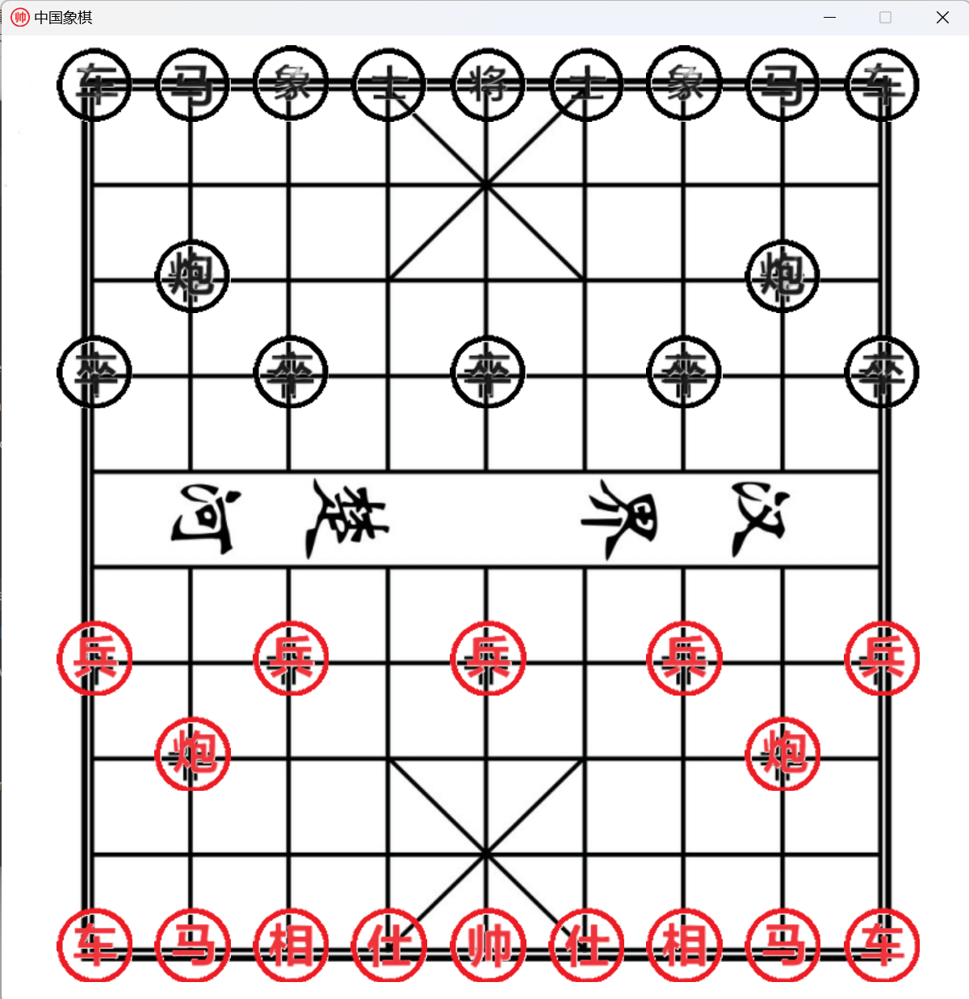

## Introduction

This is a simple (yet rudimentary) Chinese Chess program developed using C++ and the Qt framework, allowing users to play against the computer.

The program employs the traditional alpha-beta pruning algorithm to compute the best moves, with a search depth set to 4 (increasing the depth would significantly increase the computation time). It utilizes heuristic functions to estimate the positional advantage in the game.

## How to Build

If you're new to Qt, the easiest way to acquire the Qt libraries is by using [vcpkg](https://github.com/microsoft/vcpkg).

1. **Install vcpkg**

   Choose a suitable location (e.g., C:/dev/) and execute the following commands in your terminal:

   ```powershell
   git clone https://github.com/microsoft/vcpkg
   cd vcpkg
   ./bootstrap-vcpkg.bat
   ./vcpkg integrate install
   ```

2. **Install Qt libraries**

   At your vcpkg installation path (e.g., C:/dev/vcpkg/), execute:

   ```powershell
   ./vcpkg install qt-base:x64-windows
   ```

3. **Download and build the project**

   Clone the repository and open the root directory with Visual Studio. Visual Studio will automatically recognize the CMake project and use vcpkg. Press Ctrl+F5 to build and run.

   Alternatively, you can build the project without Visual Studio by following the [vcpkg usage instructions](https://github.com/microsoft/vcpkg).
   
   
